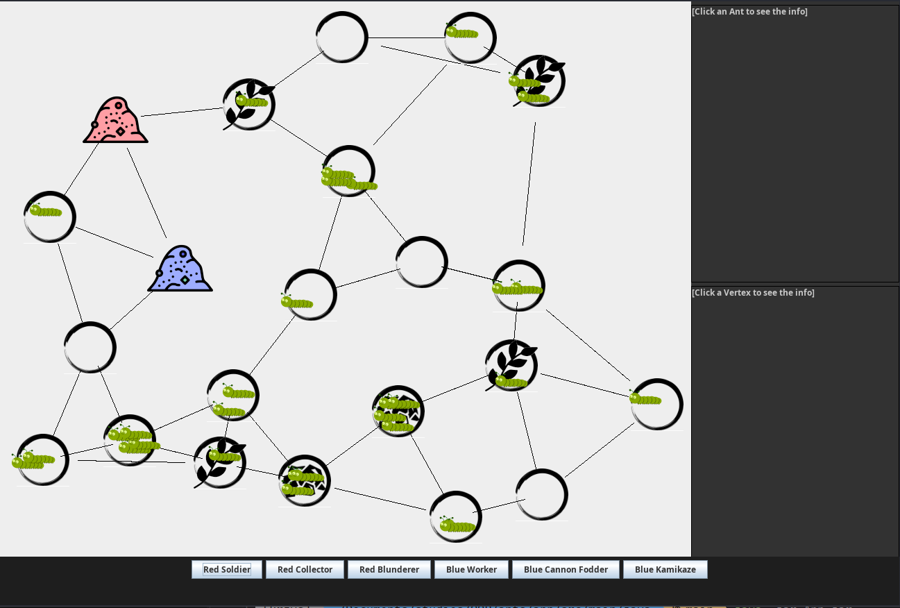

## This is a gradle project

To run the source code (located at ants/app/src/main/java/ants) run from the top ants directory (directory with settings.gradle)

```
gradle run
```

Every IDE should also be able to import gradle project

## JAR file

Jar is also located at the top as `app.jar`

To run it run:

```
java -jar app.jar
```

## Java

While developing _Java 11_ was used, but even lower version of java should handle it without problem

## How it should look

After running, a window should appear looking like this:



## How to use

Buttons add ants. You can click on the ants and vertices to display their info on the right side.
To unfocus you can click wherever
